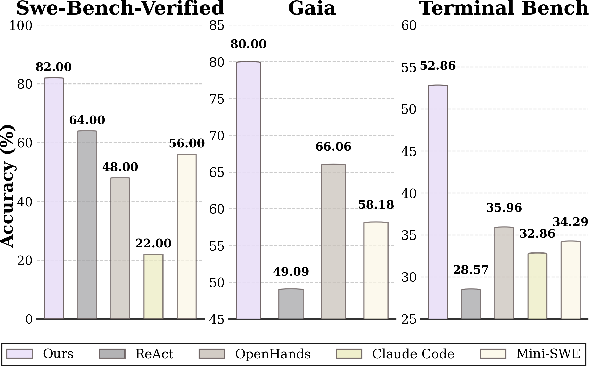
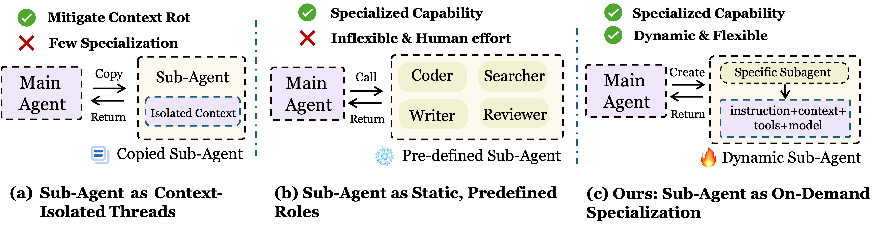
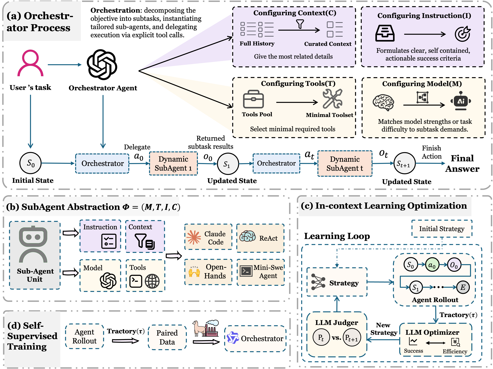

# AOrchestra: Automating Sub-Agent Creation for Agentic Orchestration

[](https://arxiv.org/abs/2602.03786)

> If you encounter any difficulties in using or reproducing the code, please contact me at [aurorra1123@gmail.com](mailto:aurorra1123@gmail.com).


We introduce our AOrchestra. Across three challenging benchmarks (GAIA, SWE-Bench, Terminal-Bench), AOrchestra achieves a 16.28% relative improvement over the strongest baseline when paired with Gemini-3-Flash.


<p align="center">
  
</p>

Prior sub-agent designs in long-horizon agentic systems typically fall into two gaps. One treats sub-agents as context-isolated threads or copied agents, which can reduce context rot but offers limited specialization because the sub-agent’s capabilities are largely fixed. The other relies on static, predefined roles (e.g., coder/searcher/writer), which provides specialization but is inflexible and requires substantial human engineering to maintain across tasks and environments. In contrast, AOrchestra views a sub-agent as a configurable unit specified by a four-tuple $\phi=\langle I,C,T,M\rangle$. 


[](figure/diff.pdf)

## Core Idea



Our core claim is that agent orchestration becomes modular, controllable, and plug-and-play when we model any (sub-)agent as a four-tuple interface $\langle I,C,T,M\rangle$ and let a central orchestrator concretize this interface at runtime. This abstraction decouples orchestration from execution: the orchestrator focuses on goal decomposition and tuple synthesis—writing actionable instructions $I$, curating context $C$, selecting tools $T$, and choosing models $M$—while dynamically created sub-agents focus on executing delegated subtasks. As a result, the system can specialize sub-agents per subtask, explicitly control context sharing to mitigate long-horizon degradation, and navigate performance–cost trade-offs through configurable choices of $C$, $T$, and $M$, without relying on static roles or full-context copying.


## Repository Layout

```text
.
├── bench_aorchestra_gaia.py
├── bench_aorchestra_swebench.py
├── bench_aorchestra_terminalbench.py
├── aorchestra/                 # MainAgent/SubAgent framework
├── benchmark/                  # Benchmark adapters and datasets
├── config/example/benchmarks/  # Benchmark config templates
└── config/example/model_config.yaml
```

## Quick Start

```bash
# 1) Install
conda create -n orchestra python=3.13 && conda activate orchestra
pip install -r requirements.txt

# 2) Configure
cp .env.example .env
cp config/example/model_config.yaml config/
cp -r config/example/benchmarks config/

# 3) Fill in API keys
vim .env
vim config/model_config.yaml
```

## Dataset Setup

| Benchmark | Download | Put it here |
|---|---|---|
| **GAIA** | https://huggingface.co/datasets/gaia-benchmark/GAIA | `benchmark/gaia/data/Gaia/` (config expects `benchmark/gaia/data/Gaia/2023/validation/metadata.jsonl`) |
| **TerminalBench** | https://www.tbench.ai/leaderboard/terminal-bench/2.0 | `benchmark/terminalbench/terminal-bench/` (config default: `benchmark/terminalbench/terminal-bench/test`) |
| **SWE-bench** | Already prepared in this project setup | Use `config/benchmarks/aorchestra_swebench.yaml` (`dataset_name: princeton-nlp/SWE-bench_Verified`) |

Recommended commands:

```bash
# GAIA (gated Hugging Face dataset; requires accepted access + HF login)
huggingface-cli download gaia-benchmark/GAIA --repo-type dataset --local-dir benchmark/gaia/data/Gaia

# TerminalBench (clone task repo so /test is available)
git clone --depth=1 https://github.com/laude-institute/terminal-bench-2.git benchmark/terminalbench/terminal-bench
```

## API Keys

### By Benchmark

| Benchmark | Required API Keys | Optional |
|---|---|---|
| **GAIA** | `JINA_API_KEY`, `SERPER_API_KEY`, LLM key in `config/model_config.yaml` | - |
| **SWE-bench** | LLM key in `config/model_config.yaml`, Docker | - |
| **TerminalBench** | LLM key in `config/model_config.yaml`, Docker or `E2B_API_KEY` | `DAYTONA_API_KEY` |

### By Tool

| Tool | Environment Variable | Purpose | Obtain From |
|---|---|---|---|
| Jina | `JINA_API_KEY` | Web content extraction | https://jina.ai/ |
| Serper | `SERPER_API_KEY` | Google search | https://serper.dev/ |
| E2B | `E2B_API_KEY` | Cloud sandbox | https://e2b.dev/ |
| Daytona | `DAYTONA_API_KEY` | Cloud sandbox | https://daytona.io/ |
| LLM | in `config/model_config.yaml` | Model calls | OpenAI / Gemini / Claude etc. |

## Run

| Benchmark | Command |
|---|---|
| **GAIA** | `python bench_aorchestra_gaia.py --config config/benchmarks/aorchestra_gaia.yaml` |
| **SWE-bench** | `python bench_aorchestra_swebench.py --config config/benchmarks/aorchestra_swebench.yaml` |
| **TerminalBench** | `python bench_aorchestra_terminalbench.py --config config/benchmarks/aorchestra_terminalbench.yaml` |

Common CLI options:

```bash
--config config/benchmarks/xxx.yaml
--max_concurrency 5
--tasks task1,task2
```

Benchmark-specific options:

- GAIA: `--skip_completed <path/to/results.csv>`
- SWE-bench: `--skip-completed`
- TerminalBench: `--skip_completed`


## Citation

```bibtex
@misc{ruan2026aorchestraautomatingsubagentcreation,
      title={AOrchestra: Automating Sub-Agent Creation for Agentic Orchestration},
      author={Jianhao Ruan and Zhihao Xu and Yiran Peng and Fashen Ren and Zhaoyang Yu and Xinbing Liang and Jinyu Xiang and Bang Liu and Chenglin Wu and Yuyu Luo and Jiayi Zhang},
      year={2026},
      eprint={2602.03786},
      archivePrefix={arXiv},
      primaryClass={cs.AI},
      url={https://arxiv.org/abs/2602.03786},
}
```
